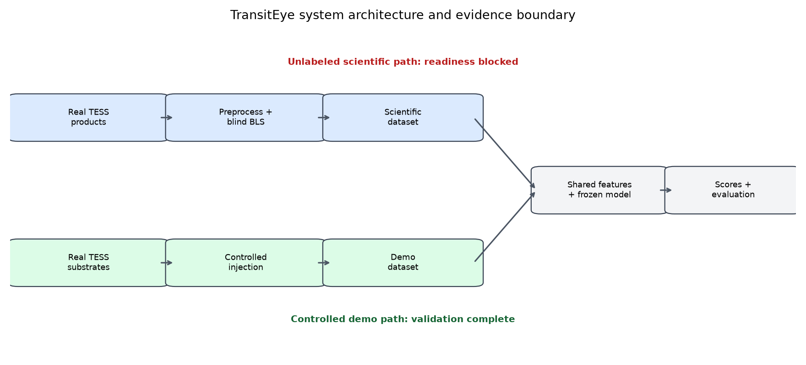

# TransitEye

TransitEye is a reproducible candidate-level exoplanet transit detection and
classification pipeline for TESS light curves. It combines blind Box Least
Squares (BLS) detection with time-domain, detector-derived, Lomb–Scargle, and
FFT features. Machine-learning performance is currently established on a
controlled synthetic-injection demo, not on labeled real TESS candidates.

> **Project status**
>
> **Software pipeline: COMPLETE**<br>
> **Demo pipeline: COMPLETE**<br>
> **Scientific readiness: BLOCKED**
>
> Scientific evaluation is blocked because the pilot has no independently
> labeled real candidate cohort, injected-demo and scientific feature
> distributions differ substantially, and the number of independent TIC groups
> is too small for defensible real-data statistics. This is an evidence boundary,
> not a software failure.

## Overview

TransitEye preserves two related paths. The scientific path processes real
TESS-SPOC light curves through preprocessing, blind BLS, shared features, and
frozen demo-trained inference. Its 75 candidate scores are exploratory and all
75 candidates remain unlabeled. The demo path injects deterministic planet-like
and confounding signals into real TESS substrates, then reuses the same
downstream pipeline for controlled validation.



```text
                 TransitEye
                    |
        +-----------+-----------+
        |                       |
  SCIENTIFIC PATH           DEMO PATH
        |                       |
    real TESS           real TESS substrate
        |                  + injections
        |                       |
        +-----------+-----------+
                    |
              shared features
                    |
               shared model
                    |
          scores and evaluation
```

Catalog ephemerides and synthetic truth are evaluation metadata. They never
enter feature generation or model inputs.

## Scientific objective

The project tests whether blind transit-like events can be generated and vetted
at candidate level with an auditable classical-ML pipeline. A candidate event is
the ML unit; its source TIC is the split and uncertainty unit. BLS event recovery
and classifier correctness are reported as separate stages and as an additional
end-to-end controlled measure.

## Pipeline stages and features

1. Freeze TOI catalog, cohort, and TESS-SPOC product discovery.
2. Preserve raw products and preprocess light curves with provenance.
3. Run blind BLS and retain ranked candidate events.
4. Join truth only after detection for matching and evaluation.
5. Extract 65 registered model features: 25 time-domain, 16 BLS, 11
   Lomb–Scargle, and 13 FFT.
6. Compare Logistic Regression, Random Forest, RBF SVM, and ELM with
   training-only transformations.
7. Evaluate grouped splits, leave-one-TIC-out robustness, injection recovery,
   calibration, interpretation, and domain shift.
8. Freeze a reproducibility manifest and deterministic report assets.

The selected frozen model is Random Forest
`model-4a58f313bc50b9c3dc41` with threshold `0.325`.

## Evaluation summary

The strongest controlled summary is six-development-TIC leave-one-TIC-out
performance: pooled PR-AUC is approximately **0.974** and F1 approximately
**0.871**. Per-TIC PR-AUC ranges from about **0.846 to 1.000**, and per-TIC F1
from **0.625 to 1.000**. This variation is more informative than the perfect
locked-test result.

The locked development-demo test has PR-AUC and F1 of **1.0**, but contains only
two held-out TICs. It is not evidence of population-level scientific
generalization. BLS recovery ranges from **72.7% to 100%** across synthetic event
families, with end-to-end success varying by class.

For the scientific path, 67 of 75 unlabeled candidates violate robust demo
support for at least one feature. The demo-trained model scores all 75 above the
frozen decision threshold; this is a domain-transfer warning, not a catalog of
planets. See the generated [tables](results/tables/) and
[figures](results/figures/).

## Quick start

TransitEye requires Python 3.11 and uses the locked `uv` environment.
Run commands from the repository root. The submitted project distribution must
include the accepted local `data/` artifact tree; a source-only Git checkout must
restore that frozen artifact bundle at the same relative paths before
verification. No preexisting Python cache is required.

```bash
uv sync --all-groups --locked
uv run python scripts/reproduce_project.py --verify
uv run python scripts/reproduce_project.py --report
uv run python scripts/reproduce_project.py --demo-smoke
```

The verification, report, and smoke commands work offline. They do not download
MAST products or retrain the frozen model. An optional expensive local replay is
available:

```bash
uv run python scripts/reproduce_project.py --full-replay
```

Acquisition is deliberately excluded from that replay. Start with the
[usage guide](docs/usage.md) for outputs and inspection steps.

## Repository structure

| Path | Purpose |
|---|---|
| `src/transiteye/` | Production pipeline and reproducibility modules |
| `configs/` | Frozen and versioned policy inputs |
| `scripts/` | Stage commands and the reproduction entry point |
| `data/` | Immutable, versioned project artifacts |
| `results/` | Canonical tables, figures, index, and status |
| `docs/` | Method, architecture, usage, and limitations |
| `reports/` | Long-form technical report |
| `presentation/` | Offline demonstration support package |
| `tests/` | Offline unit, integration, and consistency checks |

## Data and artifact lineage

The portable project chain is catalog → acquisition → processed products → BLS
outputs → scientific/demo datasets → feature matrices → model → evaluations →
reproducibility package. [results/index.json](results/index.json) is the canonical
machine-readable entry point; [artifact lineage](docs/artifact_lineage.md)
summarizes the major versions.

Current frozen evaluation: `final-evaluation-a4d1c707d285fa72a87f`. Current
portable reproduction package: `repro-f43b9410e759001971ae`.

## Scientific limitations

The current project does not estimate real TESS exoplanet-classification
performance. Scientific candidates have no gold labels, candidate rows within a
TIC are correlated, synthetic morphologies cover a limited design, calibration
uncertainty is governed by few TIC groups, and demo-to-scientific covariate shift
is substantial. See [limitations](docs/limitations.md) and
[scientific method](docs/scientific_method.md).

## Development status

B001–B065 implement the technical pipeline, controlled demo evaluation,
reproducibility layer, documentation, and release acceptance. Scientific
readiness remains a separate blocked gate pending a larger independently labeled
real cohort.

## License and citation

The Python package declares the MIT license. No archival identifier is assigned;
cite the repository, frozen artifact IDs, and reproducibility version reported
above. See the [changelog](CHANGELOG.md) and [release notes](RELEASE_NOTES.md).
