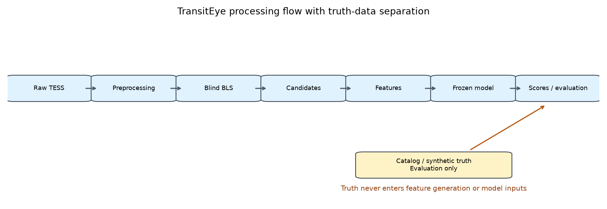
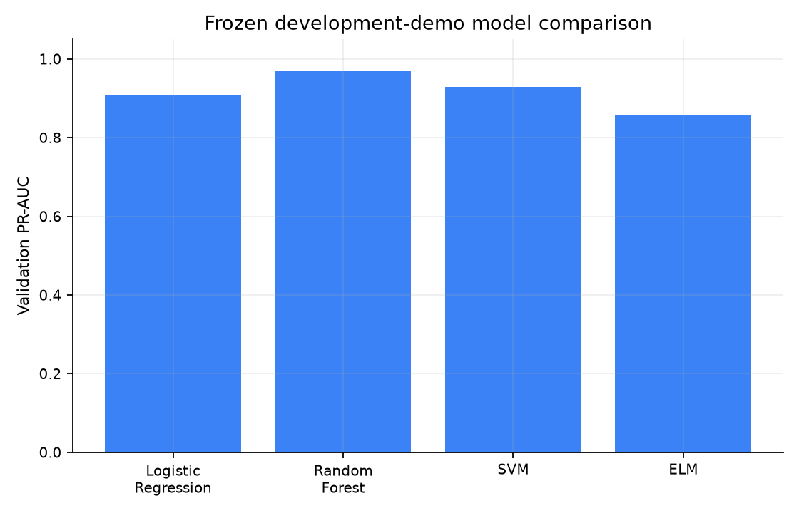
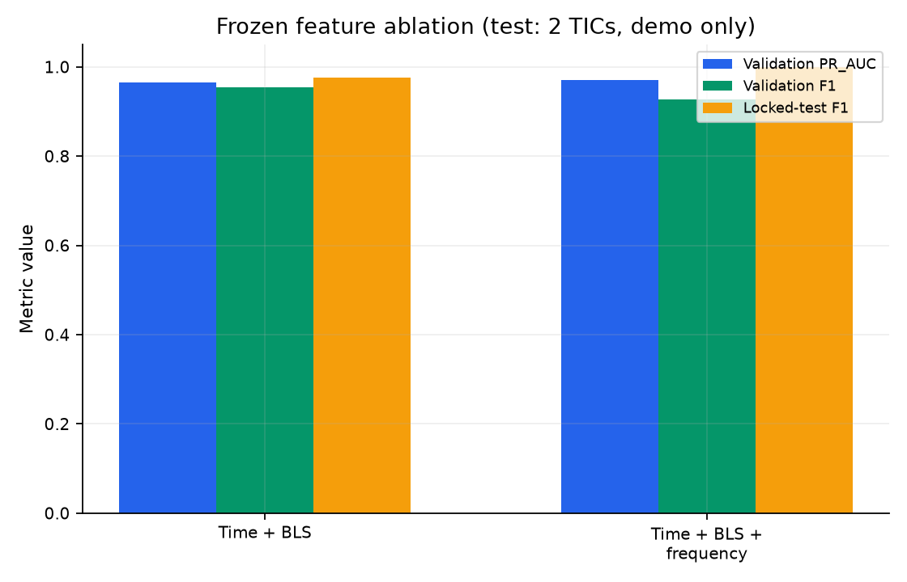
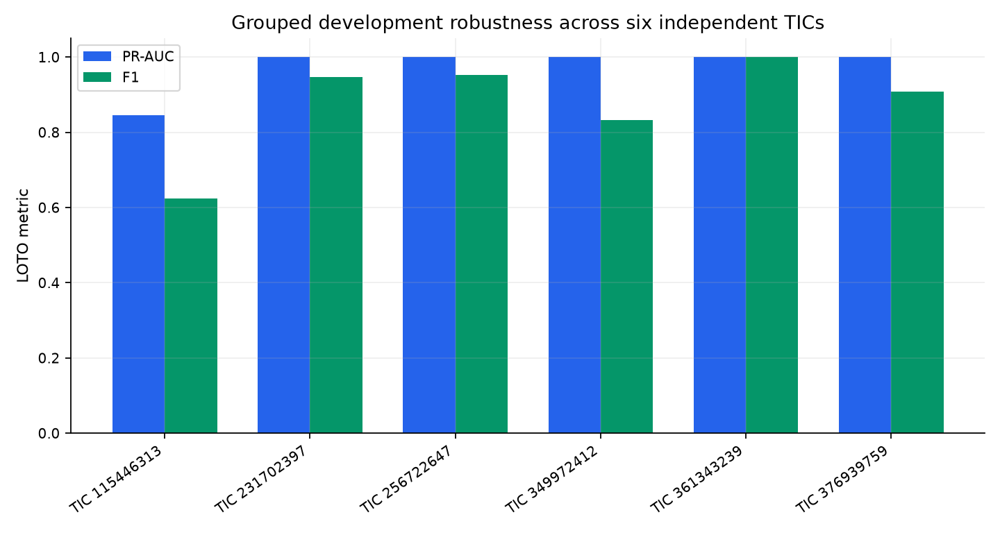
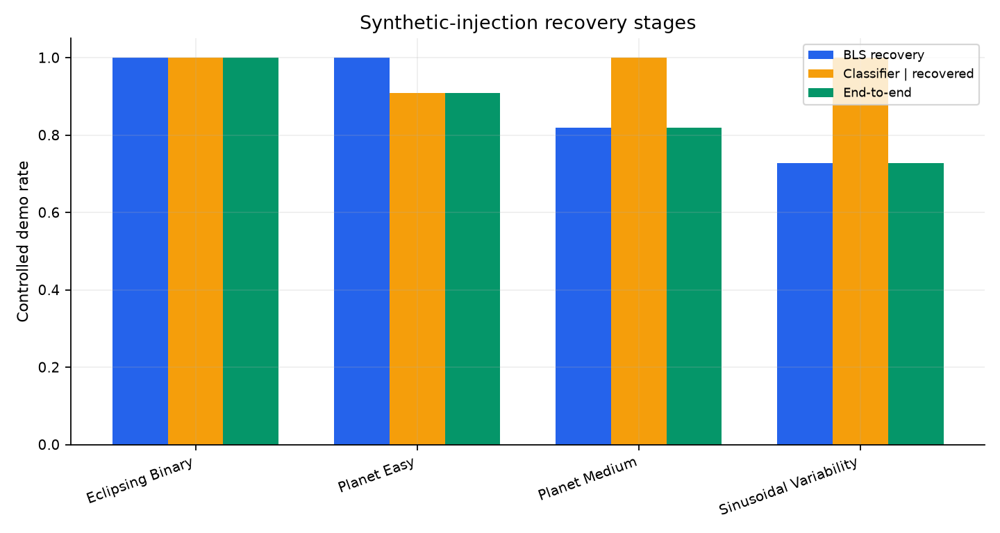
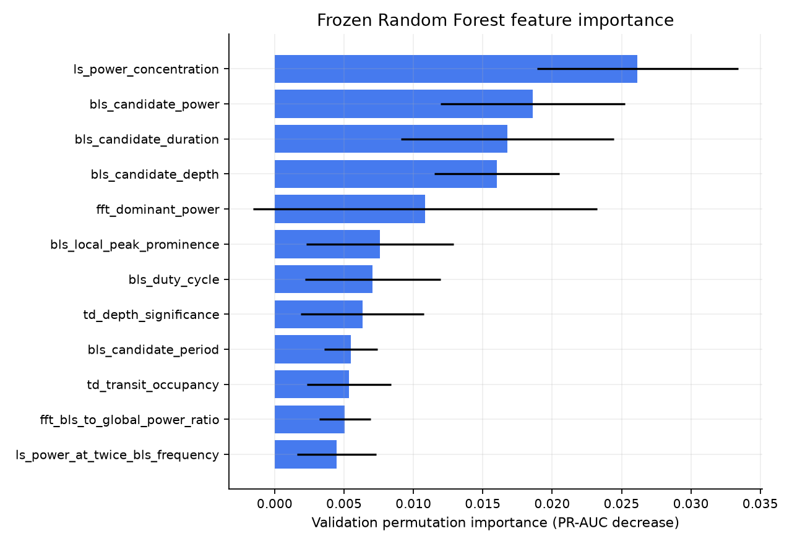
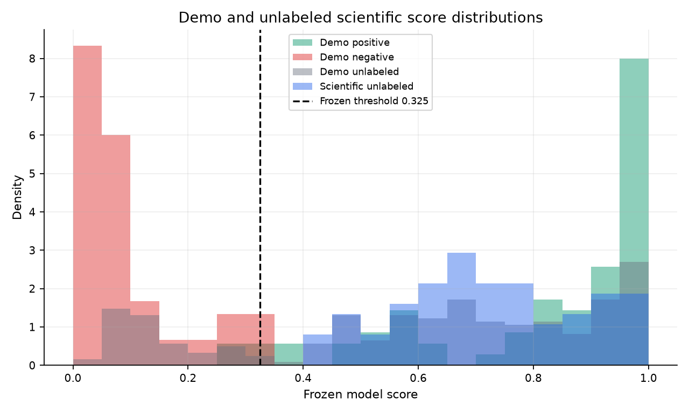
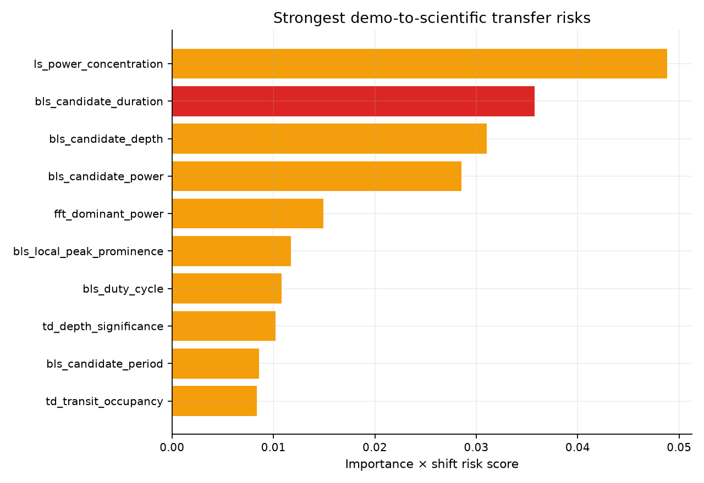
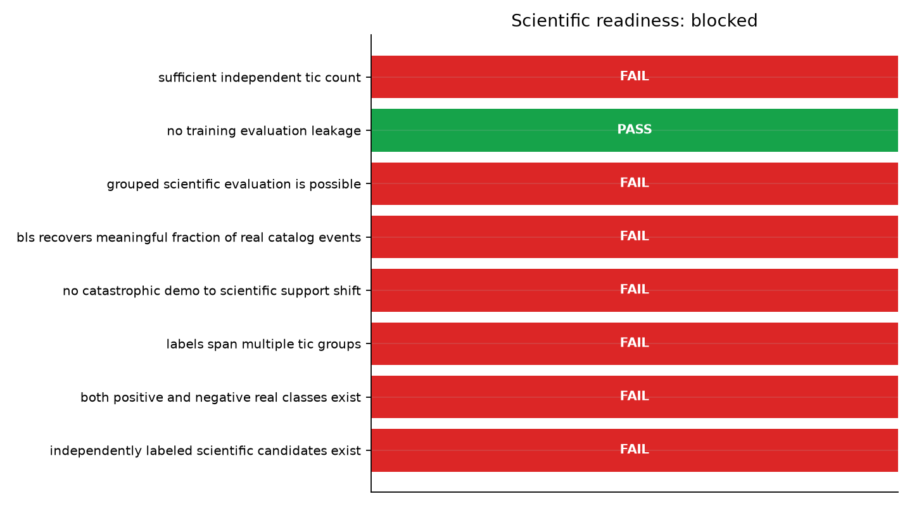

# TransitEye

## Machine Learning-Based Exoplanet Detection from Stellar Light Curves

### Using Time- and Frequency-Domain Features

## 1. Abstract

TransitEye is a reproducible candidate-level pipeline for blind transit-like
event generation and machine-learning vetting in TESS light curves. It preserves
immutable acquisition and preprocessing lineage, applies Box Least Squares
(BLS), extracts 65 time-domain, BLS, Lomb–Scargle, and FFT features, and compares
four classical model families under TIC-grouped evaluation. Because the pilot
scientific cohort lacks independent candidate labels, a separate controlled demo
injects synthetic planet-like and confounding signals into real TESS substrates
and reuses the scientific pipeline. Six-development-TIC leave-one-TIC-out (LOTO)
evaluation gives pooled PR-AUC 0.974 and F1 0.871, with substantial per-TIC
variation. BLS recovery spans 72.7%–100% by injected family. The demo-trained
model scores all 75 real candidates above threshold, while 67 violate robust demo
feature support; these candidates remain unlabeled. TransitEye therefore has a
complete software and demo pipeline, while scientific readiness is blocked.

## 2. Introduction

Transit photometry searches stellar brightness measurements for recurring
dimming compatible with an orbiting body crossing the stellar disk. Large
surveys produce many possible periods, aliases, stellar-variability signatures,
and instrumental artifacts. A useful automated system must preserve provenance,
detect candidates without consulting truth, prevent target leakage, separate
detection recovery from classification, and state where validation evidence no
longer transfers.

TransitEye implements that system as a traceable research pipeline. Its goal is
candidate generation and controlled vetting, not planet confirmation.

## 3. Problem Statement

A light curve can contain several candidate events, and a catalog entry is not
automatically the correct label for every BLS peak. Whole-light-curve labels or
random candidate splits would mix event identity and shared stellar noise. The
project instead asks whether a blind BLS proposal can become a stable candidate
record and whether candidate features discriminate controlled planet-like from
confounding injections across held-out TICs.

The scientific pilot cannot answer real candidate accuracy because all 75 real
candidate rows lack independent gold labels. Documentation and evaluation must
therefore keep controlled demo evidence separate from scientific score transfer.

## 4. Objectives

The project objectives are to:

1. acquire and freeze a traceable TESS-SPOC pilot cohort;
2. preprocess light curves without erasing transit-like excursions;
3. perform blind, deterministic BLS candidate generation;
4. represent a candidate event as the ML unit and a TIC as the split unit;
5. prevent catalog or injection truth from entering features;
6. compare transparent classical models under grouped validation;
7. measure detection, classification, robustness, calibration, and shift;
8. package all accepted artifacts for offline verification and reporting; and
9. enforce an explicit gate before scientific performance claims.

## 5. Background

NASA's Transiting Exoplanet Survey Satellite (TESS) provides time-series
photometry over sectors of the sky. TESS-SPOC light-curve products contain flux,
time, and quality information suitable for a provenance-preserving pilot.

BLS searches for periodic box-shaped reductions in flux and is a natural
baseline for transit candidate generation. A strong periodogram peak is still a
proposal: harmonics, eclipsing binaries, sinusoidal variability, gaps, and
instrumental systematics can produce competing structure. Lomb–Scargle features
summarize irregularly sampled periodic content; segment-local FFT features offer
a complementary frequency view. Classical ML then ranks candidate-level feature
vectors. It does not replace physical confirmation or independent labeling.

## 6. System Architecture


The scientific path and controlled demo path join at shared preprocessing,
detection, features, and inference. Their truth sources remain distinct. The
scientific path ends in unlabeled scores and a blocked readiness gate; the demo
path supports controlled labels and metrics.



## 7. Data Sources

Target/event context originates in a frozen NASA Exoplanet Archive TOI snapshot.
Observations are TESS-SPOC light-curve products discovered through MAST. The
frozen pilot contains eight TICs, 15 raw products, and 15 processed light curves.
Product discovery, selection, download receipts, checksums, and expansion policy
are retained. The data and pipeline summary is available in
[Table 1](../results/tables/table_1_data_pipeline_summary.csv).

## 8. Label Policy

TOI dispositions are typed and preserved. CP and KP can support positive catalog
events; FP and FA can support negative catalog events. PC, APC, unknown, and
unexpected states remain unlabeled. A catalog state becomes candidate metadata
only after post-BLS event matching. Unmatched never means negative.

For the demo, matched planet-like injected candidates are positive and matched
confounder candidates are negative. Unmatched candidates remain unlabeled. Truth
metadata can select examples for evaluation but cannot enter feature extraction
or model transformations.

## 9. Acquisition

The acquisition layer normalizes canonical numeric TIC identifiers, queries the
declared TESS-SPOC product family, freezes the product snapshot, and selects
products under a versioned policy. Raw FITS bytes are immutable. The accepted
MAST snapshot and every selected file are covered by SHA-256 verification.
Ordinary reproduction modes do not access the network.

## 10. Preprocessing

Preprocessing applies explicit quality and finite-value filtering, gap-aware
segmentation, conservative normalization and artifact handling, and declared
detrending. Downward excursions are protected rather than rejected simply as
outliers. Output tables retain masks, source identities, configuration hashes,
and checksums. Long gaps are not silently bridged.

## 11. Transit Candidate Detection

BLS scans a frozen period-duration grid on processed flux without catalog
ephemerides or injection truth. Stable local-peak selection yields ranked
candidate IDs, periods, epochs, durations, depths, powers, and related detector
statistics.

Post-detection matching compares a candidate with an event's period, epoch, and
duration under a documented tolerance and harmonic policy. Fundamental and
accepted integer-harmonic matches retain their relation. Recovery measures
whether an event produces an accepted candidate. An unrecovered catalog or
injected planet is a BLS false negative in event-recovery analysis.

## 12. Dataset Construction

The dataset contract separates candidates, catalog or synthetic events, event
matches, labels, and artifact lineage. A candidate event is the supervised unit.
The source TIC is the split unit because sectors, noise, systematics, products,
and demo variants from the same star are correlated.

The scientific dataset contains 75 unlabeled candidates. The demo dataset has
375 candidates: 70 positive, 60 negative, and 245 unlabeled. Unlabeled rows are
retained for provenance and inference but excluded from supervised metrics.

## 13. Demo Mode

Real candidate labels were insufficient for supervised scientific evaluation.
Demo mode provides isolated controlled truth without changing the scientific
path. It injects planet-like transits, eclipsing-binary-like events, sinusoidal
confounders, and controls into in-memory copies of real TESS substrates.

Every variant passes through the same preprocessing, blind BLS, candidate
matching, feature, and model infrastructure. Injection parameters and truth
matches are held behind the truth firewall. Demo results prove software behavior
and controlled recovery/classification; they do not establish real-population
performance.

## 14. Feature Engineering

The frozen model schema contains 65 features, summarized in
[Table 2](../results/tables/table_2_feature_summary.csv):

- 25 time-domain features for global, in/out-of-event, folded-shape, scatter,
  asymmetry, and coverage behavior;
- 16 BLS features for candidate measurements, rank, prominence, duty cycle, and
  harmonic structure;
- 11 Lomb–Scargle features for dominant and candidate-related irregular-sampling
  power; and
- 13 FFT features computed only on eligible local regularized segments.

Truth, labels, split, and dataset-role fields are forbidden. Missing quantities
remain null until training-only imputation.

## 15. Machine Learning

The baselines are Logistic Regression, Random Forest, RBF Support Vector Machine,
and a deterministic single-hidden-layer Extreme Learning Machine. Training
medians handle missingness. Logistic Regression, SVM, and ELM also use
training-only standardization; Random Forest inputs remain unscaled.

Validation PR-AUC selects the model. Among thresholds maximizing validation F1,
the declared tie policy freezes one threshold. Random Forest was selected and is
frozen as `model-4a58f313bc50b9c3dc41` with threshold 0.325. Scientific scores
did not influence training or selection.

## 16. Evaluation Methodology

Eight demo source TICs are deterministically split 4/2/2 for training,
validation, and locked test. Model and threshold selection use validation only.
The two test TICs remain locked until the official evaluation.

LOTO refits the frozen Random Forest policy across the six development TICs and
uses the frozen threshold. A 1,000-replicate group bootstrap resamples TICs, not
candidate rows. Pipeline evaluation reports BLS recovery, conditional classifier
correctness, and end-to-end success separately. Calibration, permutation
importance, local perturbation explanations, and demo-to-scientific shift are
diagnostic wrappers around the frozen model.

## 17. Results



[Table 3](../results/tables/table_3_model_comparison.csv) records all frozen
validation metrics. Random Forest achieved validation PR-AUC 0.971 and F1 0.927.
The official locked test achieved PR-AUC 1.0 and F1 1.0, but it contains only
two held-out TICs, is development-demo evidence, and has high sampling uncertainty.
It is not the headline scientific result.

The strongest controlled summary is pooled six-TIC LOTO PR-AUC 0.974 and F1
0.871. Per-TIC variation and bootstrap intervals are reported rather than hidden
behind the perfect small holdout.

## 18. Feature Ablation



[Table 4](../results/tables/table_4_feature_ablation.csv) compares Time+BLS with
Time+BLS+Lomb–Scargle+FFT under the frozen experiment. Frequency features improve
the selected full-model validation PR-AUC from 0.966 to 0.971, while validation
F1 differs in the other direction because the two ablations have separately
frozen validation thresholds. This is modest evidence that frequency features
contribute; it is not a claim of universal superiority.

## 19. Robustness



[Table 5](../results/tables/table_5_grouped_robustness.csv) gives pooled LOTO
PR-AUC 0.974 with TIC-bootstrap interval 0.920–1.000. Pooled F1 is 0.871 with
interval 0.765–0.957. Per-TIC PR-AUC ranges 0.846–1.000 and F1 0.625–1.000.
Six groups make these intervals descriptive rather than population-level.



[Table 6](../results/tables/table_6_injection_recovery.csv) preserves the full
cascade. BLS recovery is 100% for easy planets and eclipsing binaries, 81.8% for
medium planets, and 72.7% for sinusoidal variability. End-to-end success is
90.9%, 100%, 81.8%, and 72.7%, respectively. These are controlled injected-event
results on the frozen demo grid.

## 20. Interpretability



Validation permutation importance is the primary global method; Random Forest
impurity importance is secondary because continuous variables can receive
biased importance. Leading features include Lomb–Scargle power concentration,
BLS candidate power, duration and depth, FFT dominant power, BLS local
prominence, and depth significance. Local median-perturbation explanations retain
candidate identity and state only which features contribute to the model score.
They are not astrophysical proof.

## 21. Calibration

Calibration analysis is diagnostic and demo-only. Development OOF Brier score is
0.078, log loss 0.266, and ECE 0.131; validation ECE is 0.169. The locked-test ECE
of 0.192 is descriptive only and was not used to select a calibration transform.
Mean scores are generally underconfident relative to observed demo fractions,
but ten-bin curves are unstable with six development TIC groups. No calibrated
replacement model was fitted, and scientific scores are not planet
probabilities.

## 22. Demo-to-Scientific Domain Shift



The demo-trained classifier assigns all 75 unlabeled scientific candidates a
score above the frozen threshold; scores span 0.415–0.990. This does not mean 75
exoplanets. It means the scientific score distribution lies entirely within the
demo-positive score support while lacking outcome labels.



Sixty-seven scientific candidates have at least one robust-support violation.
Strong shifts occur across BLS harmonic, time-domain scale/depth, and frequency
features. The combined importance-shift rule marks BLS candidate duration and an
FFT-to-BLS power ratio as high-risk transfer drivers. These associations are
plausible explanations for score instability, not causal findings. Demo-to-real
transfer is insufficiently validated.

## 23. Scientific Readiness



[Table 7](../results/tables/table_7_scientific_readiness.csv) records all eight
criteria. Leakage prevention passes. The following fail: independent real
candidate labels; both real binary classes; labels across multiple TICs;
acceptable feature support; established real-event BLS recovery; possible
grouped real evaluation; and sufficient independent TIC count.

```text
demo_pipeline_status = complete
scientific_readiness = blocked
```

This conclusion marks the boundary of current evidence. It does not negate the
completed software and controlled-validation work.

## 24. Limitations

The demo has only eight source TICs, with six available for grouped development
robustness and two for the official holdout. Candidate observations within a TIC
are correlated. Synthetic morphology does not span the TESS population. BLS
failure prevents downstream classification. Random Forest scores have nontrivial
demo calibration error and no scientific calibration interpretation. The
scientific cohort has no binary candidate labels and exhibits substantial
feature shift. Pixel-level centroid vetting and confirmation evidence are beyond
the current scope.

## 25. Reproducibility

Every accepted major product has a deterministic identity and parent chain. The
project-level package `repro-f43b9410e759001971ae` inventories 613 immutable
artifacts with relative paths and SHA-256 values. Model, robustness, and final
evaluation identities are fixed; the final evaluation is
`final-evaluation-a4d1c707d285fa72a87f`. Environment and Git information are
recorded as non-identity provenance.

```text
software_pipeline_status = complete
demo_pipeline_status = complete
scientific_readiness = blocked
official_model = model-4a58f313bc50b9c3dc41
official_threshold = 0.325
final_evaluation = final-evaluation-a4d1c707d285fa72a87f
repro_version = repro-f43b9410e759001971ae
```

The following work offline:

```bash
uv run python scripts/reproduce_project.py --verify
uv run python scripts/reproduce_project.py --report
uv run python scripts/reproduce_project.py --demo-smoke
```

`results/index.json` is the canonical pointer set for documentation and later
release work.

## 26. Future Work

The next scientific phase requires a larger, independently labeled real
candidate cohort containing positive and negative examples across enough TICs
for grouped evaluation. Real catalog-event BLS recovery must be measured with a
declared review policy. After support and calibration are reevaluated, external
validation, richer confounder morphology, centroid diagnostics, and model
retraining may be considered under new version identities. None of these steps
should overwrite the current frozen benchmark.

## 27. Conclusion

TransitEye demonstrates an end-to-end, leakage-resistant, candidate-level TESS
pipeline with strong controlled demo discrimination, variable but high grouped
robustness, measurable injection recovery, transparent model interpretation,
and reproducible offline verification. Its central scientific conclusion is
also explicit: current real candidate scores cannot support performance or
discovery claims. The software and demo pipelines are complete; a larger labeled
real cohort is the prerequisite for scientific evaluation.

## 28. References

1. Ricker, G. R., et al. (2015). *Transiting Exoplanet Survey Satellite
   (TESS)*. Journal of Astronomical Telescopes, Instruments, and Systems.
2. Kovács, G., Zucker, S., & Mazeh, T. (2002). *A box-fitting algorithm in the
   search for periodic transits*. Astronomy & Astrophysics.
3. Lomb, N. R. (1976). *Least-squares frequency analysis of unequally spaced
   data*. Astrophysics and Space Science.
4. Scargle, J. D. (1982). *Studies in astronomical time series analysis. II.
   Statistical aspects of spectral analysis of unevenly spaced data*. The
   Astrophysical Journal.
5. Breiman, L. (2001). *Random forests*. Machine Learning.
6. Cortes, C., & Vapnik, V. (1995). *Support-vector networks*. Machine Learning.
7. Huang, G.-B., Zhu, Q.-Y., & Siew, C.-K. (2006). *Extreme learning machine:
   Theory and applications*. Neurocomputing.
8. NASA Exoplanet Archive. *TESS Project Candidates table and TAP service*.
9. Mikulski Archive for Space Telescopes. *TESS-SPOC light-curve products*.

Bibliographic identifiers should be verified during final release preparation;
no unverified DOI is asserted here.
